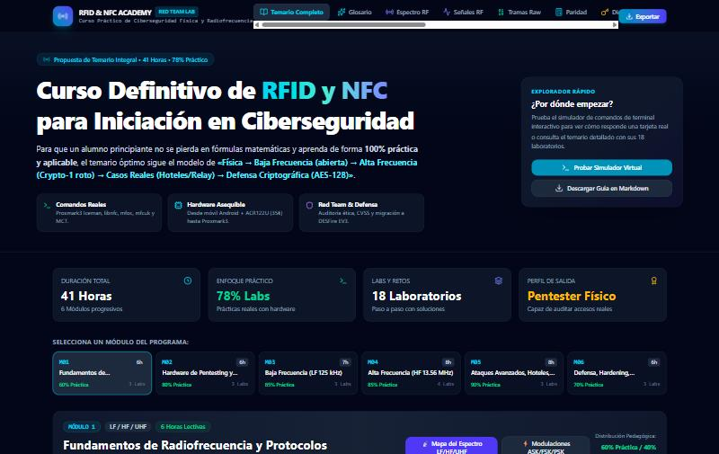
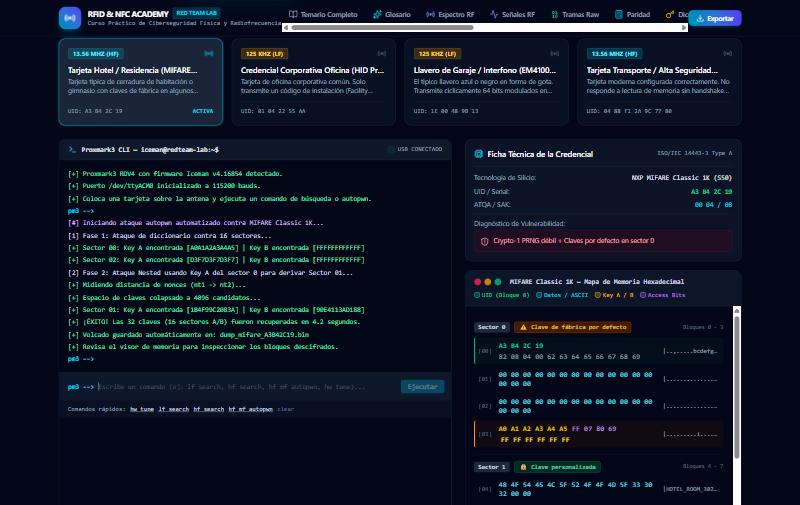
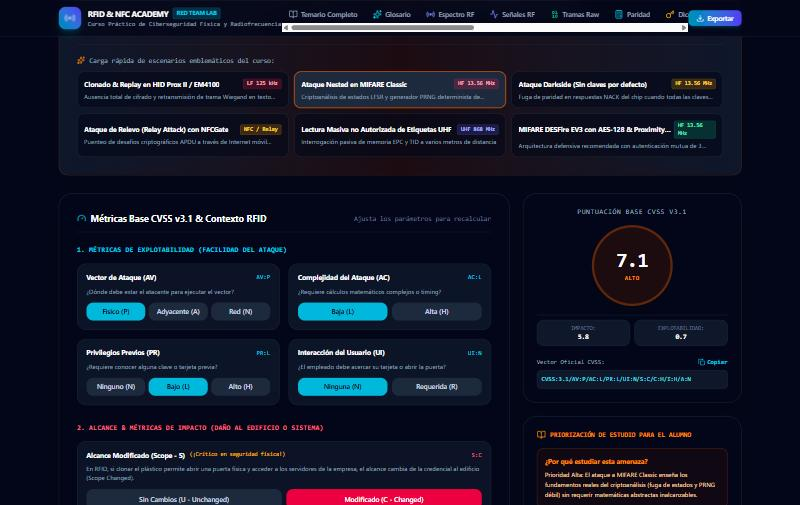
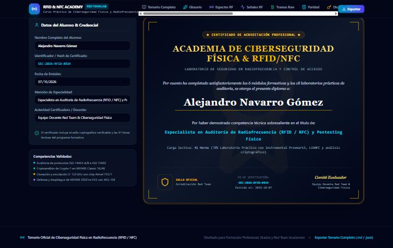

# Curso RFID & NFC · Temario y Laboratorio Virtual

[](https://www.typescriptlang.org/)
[](https://react.dev/)
[](https://tailwindcss.com/)
[](https://vitejs.dev/)
[](https://www.unfantasmaenelsistema.com/)

> **Curso RFID & NFC** es el temario completo y el laboratorio virtual de un curso práctico de ciberseguridad física en radiofrecuencia: 6 módulos, 41 horas lectivas y 18 laboratorios guiados, con más de una decena de simuladores interactivos (CRC, paridad, osciloscopio de modulación, terminal Proxmark3 simulado, calculadora CVSS, etc.) para practicar sin necesidad de hardware. Desarrollado por [unfantasmaenelsistema.com](https://www.unfantasmaenelsistema.com/).

No requiere backend ni clave de API: es una SPA 100% cliente que se compila a estáticos con Vite.

---

## 📸 Capturas de la Interfaz

### 1. Temario Completo: 6 Módulos, 41 Horas, 18 Laboratorios
Vista general del programa con progreso pedagógico por módulo (% práctica, horas lectivas, laboratorios vinculados) y navegación directa a cada lección con sus objetivos, conceptos clave, herramientas y ejercicio práctico.



---

### 2. Laboratorio Virtual: Terminal Proxmark3 Simulado
Consola interactiva que reproduce la CLI de Iceman (incluido `hf mf autopwn` paso a paso) junto con un selector de tarjetas de prueba y un visor de memoria hexadecimal de MIFARE Classic en vivo, sin necesidad de hardware conectado.



---

### 3. Calculadora de Riesgo CVSS v3.1 para Vulnerabilidades RFID/NFC
Evaluación de severidad con la fórmula oficial CVSS v3.1 (FIRST) adaptada a contexto RFID/NFC: vector de ataque físico/adyacente, alcance modificado y métricas de impacto, con 6 escenarios de ataque precargados (HID Prox Replay, Nested, Darkside, Relay/NFCGate, UHF sniffing, DESFire EV3).



---

### 4. Certificado de Acreditación Exportable
Módulo final del curso: genera un certificado de finalización con identificador de verificación único, competencias validadas y diseño listo para imprimir o adjuntar en LinkedIn.



---

## ⚡ Características Principales

### 📘 1. Temario Completo (`CurriculumView`)
- 6 módulos progresivos (Fundamentos RF → Hardware → Baja Frecuencia 125 kHz → Alta Frecuencia MIFARE → Ataques Avanzados → Defensa y Hardening), 41 horas, 78% práctico.
- 18 lecciones con objetivos de aprendizaje, conceptos clave, herramientas requeridas y ejercicio práctico con comandos reales.
- Enlaces directos desde cada lección a su simulador correspondiente (espectro, señales, clonado, ataques).

### 📖 2. Glosario Técnico & Flashcards (`TechnicalGlossary`, `FlashcardQuiz`)
Diccionario de acrónimos y estándares (UID, ATQA/SAK, MIFARE Classic/DESFire, Proxmark3, Crypto-1, Wiegand) con modo flashcards y modo test de autoevaluación.

### 📡 3. Mapa del Espectro & Osciloscopio de Señal (`FrequencySpectrumMap`, `SignalVisualizer`)
Comparativa visual de bandas LF/HF/UHF, comportamiento frente a agua/metal/cuerpo humano, y un osciloscopio digital que modula en vivo ASK, FSK y PSK sobre una cadena de bits configurable.

### 🔎 4. Decodificador de Tramas en Bruto (`RawFrameDecoder`)
Descompone cualquier trama hexadecimal ISO 14443-A en preámbulo, SOF, payload, paridad impar por byte, **CRC-16 calculado en tiempo real** y EOF, con 8 tramas reales de ejemplo (REQA, WUPA, anticolisión, SELECT, SAK, AUTH, READ, APDU).

### 🧮 5. Calculadora de Paridad (`ParityCalculator`)
Paridad horizontal/vertical EM4100 (64-bit), paridad par/impar Wiegand 26-bit y paridad impar por byte ISO 14443-A, con explicación del ataque Darkside sobre fuga de paridad en MIFARE.

### 🔑 6. Generador de Diccionarios MIFARE (`WordlistGenerator`)
Construye archivos `.dic`/`.keys` combinando claves de fábrica NXP, secuencias numéricas, patrones de bytes repetidos y derivaciones por UID, listos para `hf mf chk` en Proxmark3 o MCT en Android.

### ⚖️ 7. Calculadora de Riesgo CVSS v3.1 (`RiskScoringCalculator`)
Implementación exacta de la fórmula base CVSS v3.1 (FIRST) con 6 vulnerabilidades RFID/NFC precargadas y vector oficial exportable.

### 🖥️ 8. Laboratorio Virtual Integrado (`InteractiveTerminalLab`)
Cuatro modos en una sola vista: práctica guiada paso a paso, consola libre tipo Proxmark3 CLI, simulador visual de flujo de ataques (Nested, Replay, Darkside, Relay) y laboratorio de clonado HID Prox II / T5577 con estado electromagnético en vivo y lector de pared simulado.

### 🛡️ 9. Matriz de Ataques & Guía de Hardware (`AttackMatrixView`, `HardwareKitGuide`)
Comparativa de tecnologías RFID/NFC frente a vectores de ataque reales, y guía de equipamiento desde un móvil Android + ACR122U (35€) hasta Proxmark3 RDV4.

### 🗓️ 10. Planificador & Certificación (`CoursePlanner`, `CertificationModule`)
Formatos de impartición (online, intensivo, formación reglada) y generación de certificado acreditativo exportable.

### 📤 11. Exportador de Temario (`SyllabusExportModal`)
Descarga la guía docente completa en Markdown o JSON estructurado.

---

## 🚀 Instalación y Desarrollo Local

### 1. Clonar el Repositorio
```bash
git clone https://github.com/unfantasmaenelsistema/Curso-RFID-NFC.git
cd Curso-RFID-NFC
```

### 2. Instalar Dependencias
> ⚠️ El `package.json` fija `vite ^8.3.0`, que choca con su propio peer-dependency `esbuild ^0.25.0`. Hasta que se actualice esa versión, instala con:
```bash
npm install --legacy-peer-deps
```

### 3. Modo Desarrollo
```bash
npm run dev
```
Abre tu navegador en `http://localhost:3000`.

### 4. Compilar para Producción
```bash
npm run build
```
Genera una SPA 100% estática en `dist/` (sin backend ni variables de entorno necesarias) lista para desplegar en cualquier hosting estático.

---

## 🧱 Stack Técnico

- **React 19** + **TypeScript** + **Vite 8**
- **Tailwind CSS v4** (`@tailwindcss/vite`)
- **lucide-react** para iconografía
- Sin dependencias de backend: toda la lógica (CRC-16, paridad, CVSS v3.1, simuladores) corre en el cliente.

---

## 📁 Estructura del Proyecto

```text
├── src/
│   ├── components/        # 24 componentes (temario, simuladores, laboratorio virtual...)
│   ├── data/               # curriculumData.ts, glossaryData.ts, simulatedCardsData.ts
│   ├── App.tsx
│   └── main.tsx
├── public/
│   └── screenshots/
├── index.html
└── vite.config.ts
```
